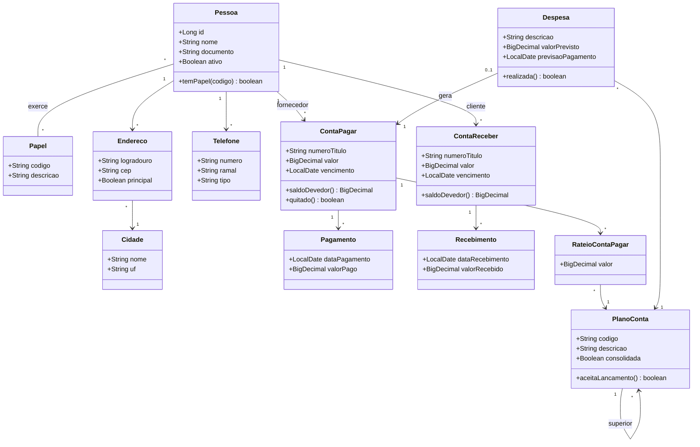
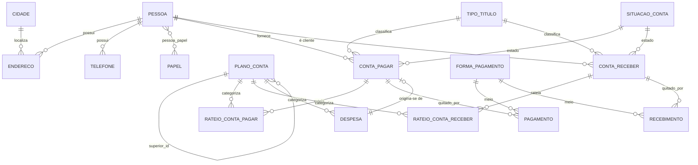
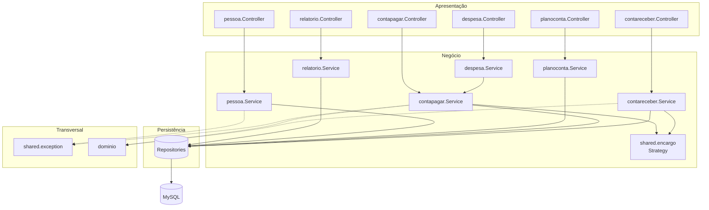
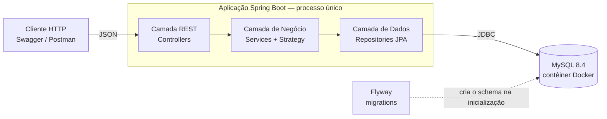
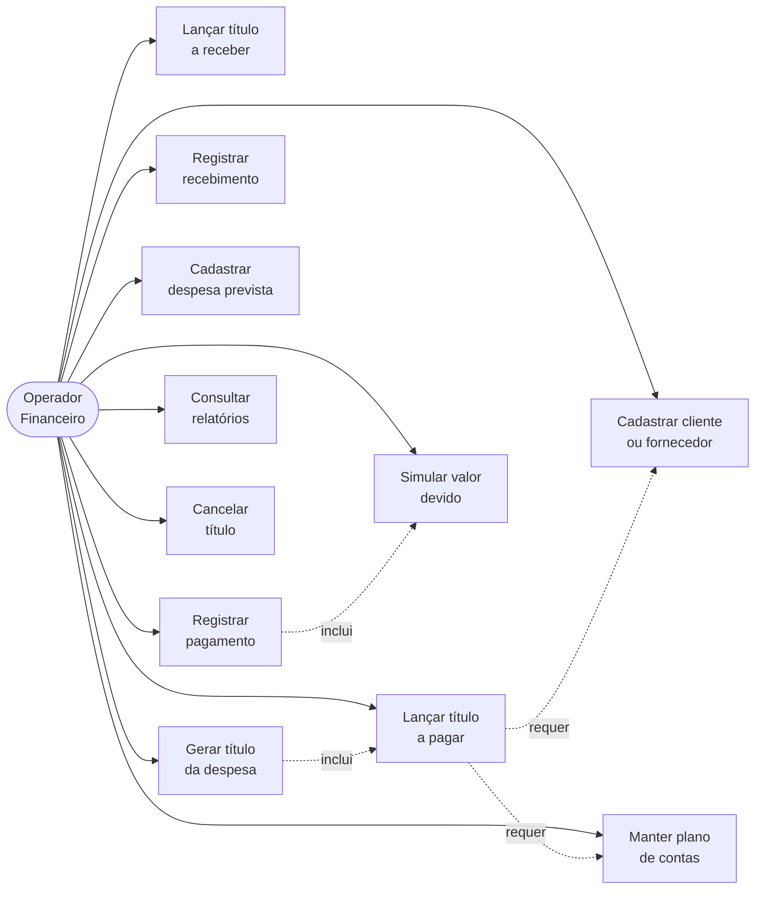
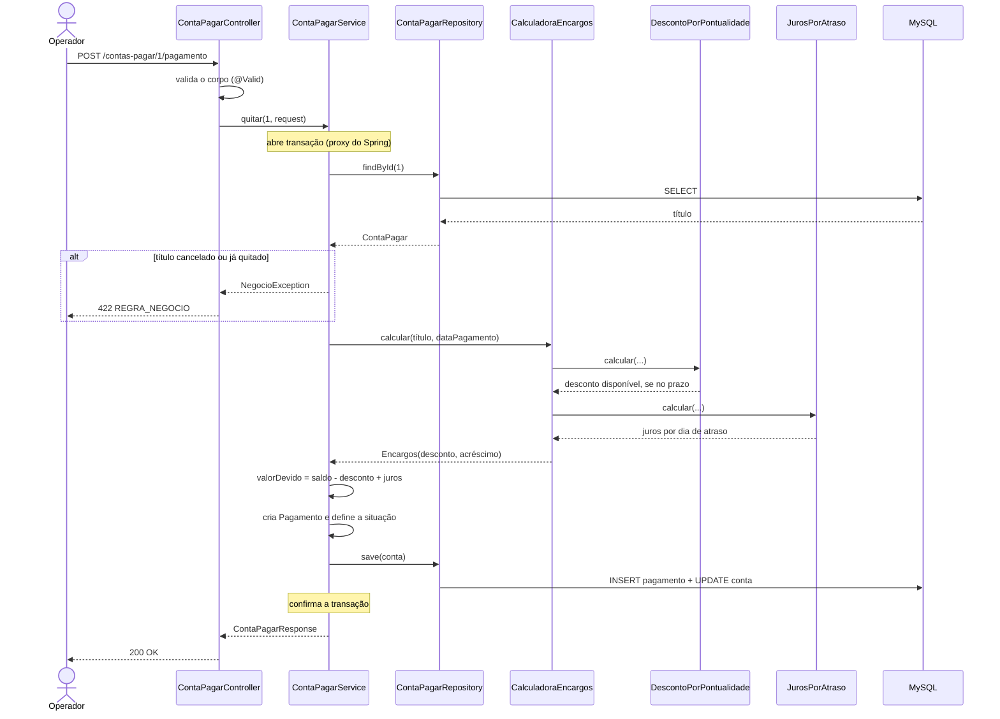
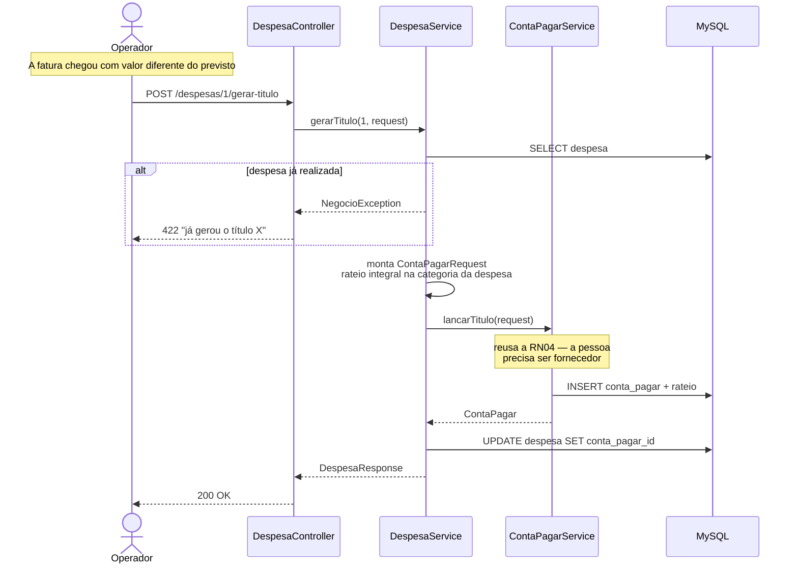
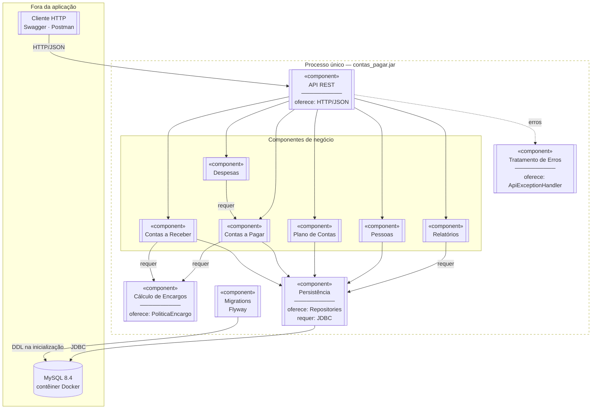

# Diagramas — Arquitetura Monolítica

Diagramas em Mermaid, renderizados automaticamente pelo GitHub. Ficam versionados junto do código para que continuem corretos quando o sistema mudar.

---

## 1. Modelo de Domínio / Diagrama de Classes

Atende aos itens *modelo de domínio* e *diagrama de classes* exigidos pelo enunciado.

---

## 2. DER — Modelo Entidade-Relacionamento

**Normalização aplicada:**

| Forma | Violação no modelo do livro | Correção |
|---|---|---|
| 1FN | `Telefone`, `Ramal`, `Fax` como colunas lado a lado | Tabela `telefone` (1:N) |
| 1FN | Endereço achatado na linha do cliente | Tabela `endereco` (1:N) |
| 2FN | — | `rateio_*` guarda o valor que depende do par (título, categoria) |
| 3FN | `Cidade` e `Estado` na linha do cliente (UF depende da cidade) | Tabela `cidade` |
| 3FN | Tipo e situação como texto na própria conta | Tabelas de domínio |

---

## 3. Diagrama de Pacotes

> **Observação relevante para a etapa 2:** `contapagar` e `contareceber` **não dependem um do outro**. É essa independência que permite recortá-los em serviços separados.

---

## 4. Arquitetura Monolítica

---

## 5. Casos de Uso

---

## 6. Diagrama de Sequência — Registrar pagamento

O fluxo mais importante do sistema, e o que melhor mostra o padrão Strategy em ação.

---

## 7. Diagrama de Sequência — Despesa vira título (RN03)

---

## 8. Diagrama de Componentes

Mostra os componentes implantáveis da aplicação e as interfaces que cada um oferece e consome. Hoje todos vivem dentro do mesmo processo — é justamente isso que caracteriza o monolito.

**Interfaces entre componentes:**

| Componente | Oferece | Requer |
|---|---|---|
| API REST | Endpoints HTTP/JSON | Componentes de negócio |
| Pessoas | `PessoaService` | Persistência |
| Plano de Contas | `PlanoContaService` | Persistência |
| Contas a Pagar | `ContaPagarService`, `lancarTitulo` | Cálculo de Encargos, Persistência |
| Contas a Receber | `ContaReceberService` | Cálculo de Encargos, Persistência |
| Despesas | `DespesaService` | **Contas a Pagar**, Persistência |
| Relatórios | `RelatorioService` | Persistência |
| Cálculo de Encargos | `PoliticaEncargo`, `CalculadoraEncargos` | — |
| Persistência | Interfaces `*Repository` | Driver JDBC |

**Duas leituras que valem para a segunda etapa:**

1. **Despesas depende de Contas a Pagar.** É a única dependência entre componentes de negócio, e é intencional — assim a RN04 não é duplicada. Na decomposição, essa chamada em memória vira uma chamada de rede, e passa a precisar de tratamento de falha.

2. **Contas a Pagar e Contas a Receber não se conhecem.** Podem virar serviços independentes sem nenhuma reescrita.
